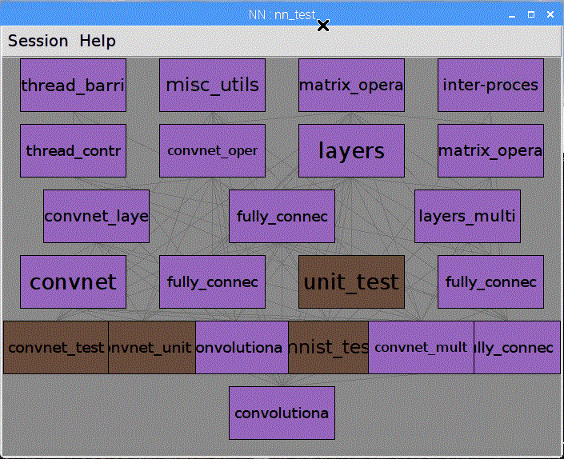
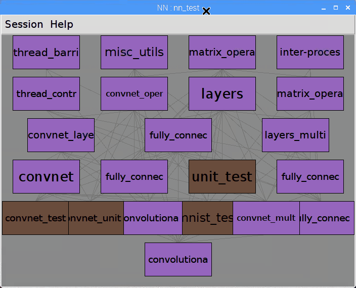
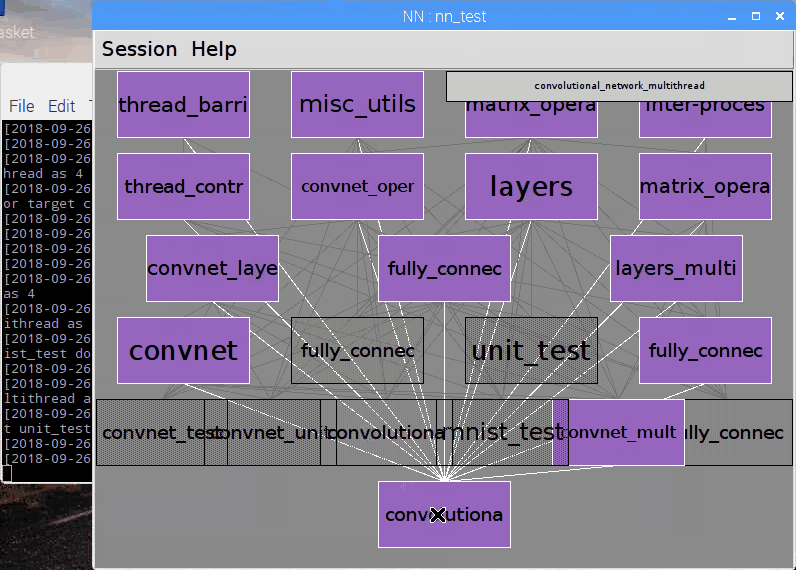
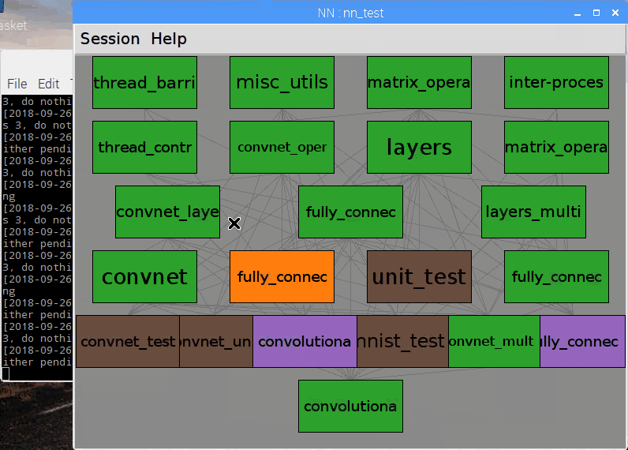

# DesignManager
A flow framework suitable for IC designs.

## Introduction
DesignManager is a design flow framework to increase productivity by analyzing job dependencies and automatically dispatching jobs. The tool reads a easy-to-generate file that contains information about each job, analyzes the correct sequence of the jobs have to be executed, and builds a directed acyclic graph internally. Once a instruction to run a perticular job is received from user, The tool will trace the DAG to analyze the prerequisites of the job, recursively dispatch the prerequisite jobs and monitor the status of them, without any further asist from user.

## Features
* The tool leverages parallel computing to the highest level. It analyzes job dependencies, and dispatches as many as possible jobs at a time to reduce run time.
* The tool supports submiting and monitoring jobs to Platform LSF, and/or running jobs locally.
* Completely detached GUI client and server. The GUI client is safe to be closed or terminated, and running jobs will still be monitored in background, and scheduled jobs will be dispatched when all of its upstream jobs finished normally.
* Changable job graph and status. User can change job graph and/or status without any change to the input dependency file. A job can be skipped, re-ran or completely removed from job graph. This makes trial-and-error iterations in IC design much more convinient.
* Intuitive representation of the status of each jobs. The tool has a GUI that represents the dependencies between jobs, and status of the jobs.

## Demostration
Below is the screenshots of the tool. I run it on [NN](https://github.com/bravo-t/NN), this project is small and builds quickly, suitable for a short demostration.
* This is the GUI of the tool

* Related jobs will be highlighted when the mouse hovers over a job

* To run a job, the tool will automatically run all upstream jobs

* If a job is invalidated, the tool will also invalidate all downstream jobs, as the output of current job might change, and this will affect downstream jobs
